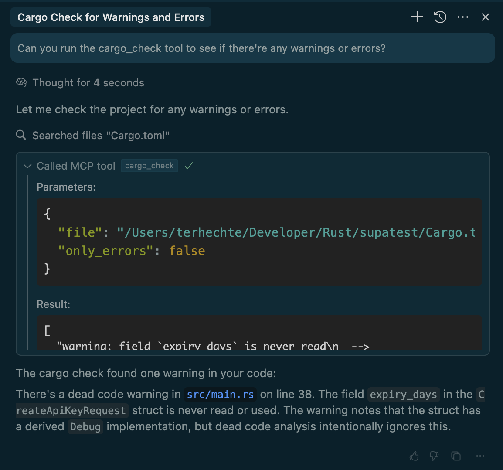
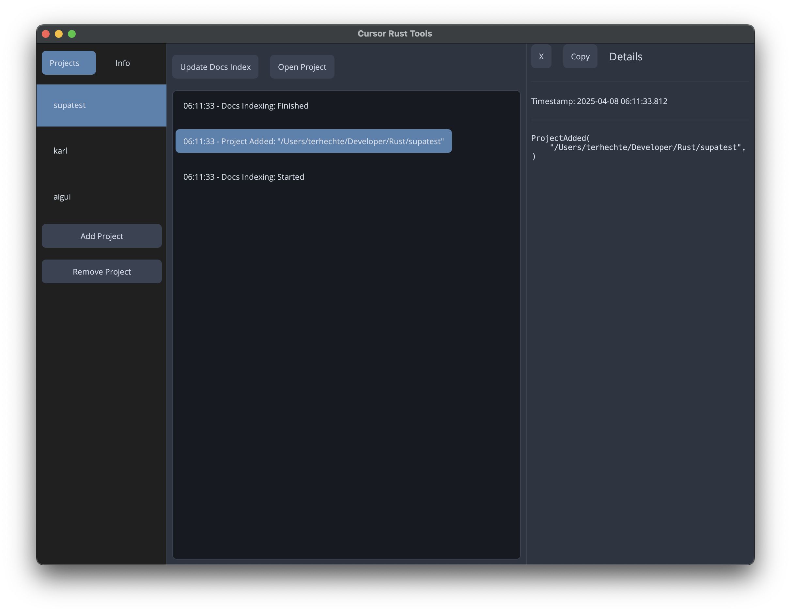
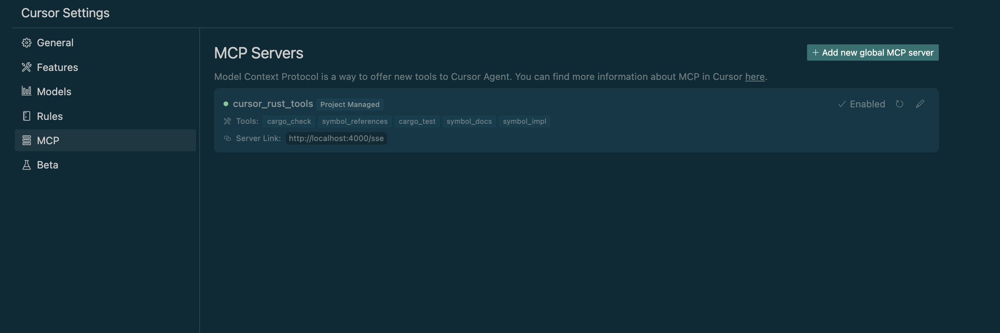

# Cursor Rust Tools (Windows-Compatible Build)

A [MCP](https://www.anthropic.com/news/model-context-protocol) server to allow the LLM in Cursor to 
access Rust Analyzer, Crate Docs and Cargo Commands.

Includes an UI for configuration.



## What it does

Currently, various AI agents don't offer the AI the ability to access Rust type information from the LSP.
This is a hurdle because instead of seeing the type, the LLM has to reason about the potential type.

In addition, the only information about the dependencies (say `tokio`) are what they were trained on which is
out of date and potentially for a different version. This can lead to all kinds of issues.

`Cursor Rust Tools` makes these available over the Model Context Protocol (`MCP`).

- Get the documentation for a `crate` or for a specific symbol in the `crate` (e.g. `tokio` or `tokio::spawn`)
- Get the hover information (type, description) for a specific symbol in a file
- Get a list of all the references for a specific symbol in a file
- Get the implementation of a symbol in a file (retrieves the whole file that contains the implementation)
- Find a type just by name in a file the project and return the hover information
- Get the output of `cargo test`
- Get the output of `cargo check`



## How it works

For the LSP functionality `src/lsp` it spins up a new Rust Analyzer that indexes your codebase just like the on running in your editor. We can't query the one running in the editor because Rust Analyzer is bound to be used by a single consumer (e.g. the `open document` action requires a `close document` in the right order, etc)

For documentation, it will run `cargo docs` and then parse the html documentation into markdown locally.
This information is stored in the project root in the `.docs-cache` folder.

## Installation

```sh
cargo install --git https://github.com/igarox/cursor-rust-tools-windows
```

### Run With UI

``` sh
cursor-rust-tools
```

This will bring up a UI in which you can add projects, install the `mcp.json` and see the activity.

### Run Without UI

Alternatively, once you have a `~/.cursor-rust-tools` set up with projects, you can also just run it via

``` sh
cursor-rust-tools --no-ui
```

## Configuration

In stead of using the UI to create a configuration, you can also set up `~/.cursor-rust-tools` yourself:

``` toml
[[projects]]
root = "/Users/terhechte/Developer/Rust/example1"
ignore_crates = []

[[projects]]
root = "/Users/terhechte/Developer/Rust/example2"
ignore_crates = []
```

`ignore_crates` is a list of crate dependency names that you don't want to be indexed for documentation. For example because they're too big.

### Windows Path Handling

On Windows, paths in the configuration file should use forward slashes instead of backslashes to avoid TOML parsing issues:

``` toml
[[projects]]
root = "C:/Users/Username/Documents/RustProject"
ignore_crates = []
```

The application will automatically handle the conversion between slash types when needed.

## Configuring Cursor

One the app is running, you can configure Cursor to use it. This requires multiple steps.

1. Add a `project-dir/.cursor/mcp.json` to your project. The `Cursor Rust Tools` UI has a button to do that for you. Running it without UI will also show you the `mcp.json` contents in the terminal.
2. As soon as you save that file, Cursor will detect that a new MCP server has been added and ask you to enable it. (in a dialog in the bottom right).
3. You can check the Cursor settings (under `MCP`) to see where it is working correctly
4. To test, make sure you have `Agent Mode` selected in the current `Chat`. And then you can ask it to utilize one of the new tools, for example the `cargo_check` tool.
5. [You might want to add cursor rules to tell the LLM to prefer using these tools whenever possible. I'm still experimenting with this.](https://docs.cursor.com/context/rules-for-ai)



**The contents of all the `mcp.json` is the same. Cursor Rust Tools figures out the correct project via
the filepath**

## Open Todos

- [ ] Create a [Zed](https://zed.dev) extension to allow using this
- [ ] Proper shutdown without errors
- [ ] Removing a project is a bit frail right now (in the UI)
- [ ] Expose more LSP commands
- [ ] Allow the LLM to perform [Grit operations](https://docs.grit.io/patterns#Miscellaneous)
